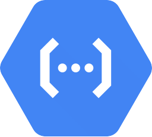

#  Cookiecutter API 

[](https://github.com/Code-and-Sorts/cookiecutter-api/actions/workflows/build-pipeline.yml)

This is a modern 🍪 Cookiecutter template to create REST APIs for multiple cloud platforms in multiple languages. This template supports the multiple cloud platforms and languages.

## 🧪 Usage

Install Cookiecutter using pip package manager:

```console
# pipx is strongly recommended.
pipx install cookiecutter

# If pipx is not an option,
# you can install Cookiecutter in your Python user directory.
python -m pip install --user cookiecutter
```

To create a Cookiecutter API project, run the following for each implemented template.

```console
# Create using the GH CLI
cookiecutter gh:Code-and-Sorts/cookiecutter-api

# Create using the GH URL
cookiecutter https://github.com/Code-and-Sorts/cookiecutter-api.git
```

Follow the prompts and answer them with your own desired options.

## ✅ Implemented

###  Azure
-  Azure Function Apps
    -  Python

## 📋 To-Do

###  Azure
-  Azure Function Apps
    -  dotnet
    -  NodeJS
    -  Go

###  Google Cloud
-  Cloud Functions
    -  Python
    -  dotnet
    -  NodeJS
    -  Go

###  AWS
-  Lambda
    -  Python
    -  dotnet
    -  NodeJS
    -  Go

---
Each project follows the controller-service-repository pattern.

## 🎯 Examples

Python
- Function App Example

## 📚 Resources

Below is a list of resources and documentation for the types of SDKs and frameworks used in the various Cookiecutter APIs.

### Python
- [Poetry](https://python-poetry.org/) for dependency management
- [pytest](https://docs.pytest.org/en/stable/) and [codecov](https://about.codecov.io/) for testing
- [pydantic](https://docs.pydantic.dev/latest/) for data validation

### Azure
- [Azure Function Apps ](https://learn.microsoft.com/en-us/azure/azure-functions/) for hosting the APIs
- [Cosmos DB](https://learn.microsoft.com/en-us/azure/cosmos-db/) for data storage

### AWS
- [Lambda docs](https://docs.aws.amazon.com/lambda/) for hosting the APIs
- [DynamoDB](https://docs.aws.amazon.com/amazondynamodb/latest/developerguide/GettingStartedDynamoDB.html) for data storage

### Google Cloud
- [Cloud Functions](https://cloud.google.com/functions/docs) for hosting the APIs
- [Firestore](https://cloud.google.com/firestore#documentation) for data storage

## 🙏🏻 Acknowledgements

Florian Maas' [cookiecutter-poetry](https://github.com/fpgmaas/cookiecutter-poetry) repository was a very helpful resource for building out this Cookiecutter template. 
