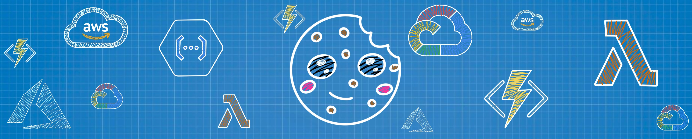
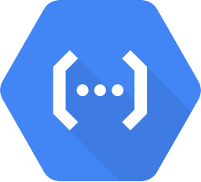

<div align="center">
  <h1>
     Cookiecutter API 
  </h1>
</div>


[](https://github.com/cookiecutter/cookiecutter)


This is a modern 🍪 Cookiecutter template to create REST APIs for multiple cloud platforms in multiple languages. This template supports the multiple cloud platforms and languages.

## 🧪 Usage

Install Cookiecutter using pip package manager:

```console
# pipx is strongly recommended.
pipx install cookiecutter

# If pipx is not an option,
# you can install Cookiecutter in your Python user directory.
python -m pip install --user cookiecutter
```

To create a Cookiecutter API project, run the following for each implemented template.

```console
# Create using the GH CLI
cookiecutter gh:Code-and-Sorts/cookiecutter-api/{LANGUAGE_OPTION}

# Create using the GH URL
cookiecutter https://github.com/Code-and-Sorts/cookiecutter-api.git --directory {LANGUAGE_OPTION}
```

Follow the prompts and answer them with your own desired options.

## 🌟 Supported Templates

<table width="100%">
  <tr>
    <th width="10%" rowspan="2"></th>
    <td width="30%" align="center"> Azure</td>
    <td width="30%" align="center"> AWS</td>
    <td width="30%" align="center"> GCP</td>
  </tr>
  <tr>
    <td align="center"> Function App</td>
    <td align="center"> Lambda</td>
    <td align="center"> Cloud Function</td>
  </tr>
  <tr>
    <td align="center"></td>
    <td align="center"><span title="Complete">✅</span></td>
    <td align="center"><span title="Planned">📋</span></td>
    <td align="center"><span title="Complete">✅</span></td>
  </tr>
  <tr>
    <td align="center"></td>
    <td align="center"><span title="Complete">✅</span></td>
    <td align="center"><span title="Planned">📋</span></td>
    <td align="center"><span title="Planned">📋</span></td>
  </tr>
  <tr>
    <td align="center"></td>
    <td align="center"><span title="Complete">✅</span></td>
    <td align="center"><span title="Planned">📋</span></td>
    <td align="center"><span title="Planned">📋</span></td>
  </tr>
  <tr>
    <td align="center"></td>
    <td align="center"><span title="Complete">📋</span></td>
    <td align="center"><span title="Planned">📋</span></td>
    <td align="center"><span title="Planned">📋</span></td>
  </tr>
</table>

---
> [!NOTE]
> Each project follows the controller-service-repository pattern.

## 🎯 Examples

Python
- [Function App Example](https://github.com/Code-and-Sorts/cookie-py-az-func-api)

Typescript
- [Function App Example](https://github.com/Code-and-Sorts/cookie-ts-az-func-api)

Dotnet
- [Function App Example](https://github.com/Code-and-Sorts/cookie-cs-az-func-api)

## 📚 Resources

Below is a list of resources and documentation for the types of SDKs and frameworks used in the various Cookiecutter APIs.

### Python
- [Poetry](https://python-poetry.org/) for dependency management
- [pytest](https://docs.pytest.org/en/stable/) and [codecov](https://about.codecov.io/) for testing
- [pydantic](https://docs.pydantic.dev/latest/) for schema validation

### Typescript NodeJS
- [Yarn](https://yarnpkg.com/) for dependency management
- [Jest](https://jestjs.io/) for testing
- [Zod](https://zod.dev/) for schema validtion

## Dotnet
- [Nuget](https://www.nuget.org/) for dependency management
- [xUnit](https://xunit.net/) for testing
- [FluentValidation](https://docs.fluentvalidation.net/en/latest/) for schema validtion

### Azure
- [Azure Function Apps ](https://learn.microsoft.com/en-us/azure/azure-functions/) for hosting the APIs
- [Cosmos DB](https://learn.microsoft.com/en-us/azure/cosmos-db/) for data storage

### AWS
- [Lambda docs](https://docs.aws.amazon.com/lambda/) for hosting the APIs
- [DynamoDB](https://docs.aws.amazon.com/amazondynamodb/latest/developerguide/GettingStartedDynamoDB.html) for data storage

### Google Cloud
- [Cloud Functions](https://cloud.google.com/functions/docs) for hosting the APIs
- [Firestore](https://cloud.google.com/firestore#documentation) for data storage

## 🙏🏻 Acknowledgements

Florian Maas' [cookiecutter-poetry](https://github.com/fpgmaas/cookiecutter-poetry) repository was a very helpful resource for building out this Cookiecutter template.
