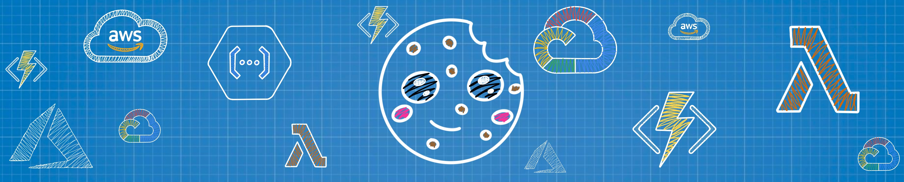
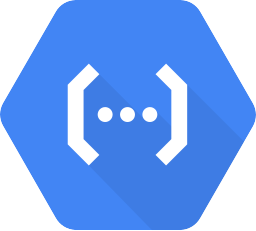
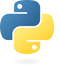
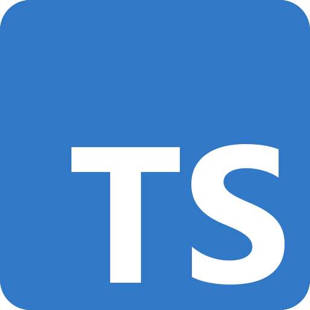

<div align="center">
  <h1>
     Cookiecutter API 
  </h1>
</div>


[](./LICENSE)

[](https://github.com/copier-org/copier)


A [Copier](https://github.com/copier-org/copier) template for generating REST APIs across multiple cloud platforms and languages.

## Usage

Install Copier 9.18.2 or newer (and the Jinja extensions the templates use) with pip or pipx:

```console
# pipx is strongly recommended.
pipx install copier
pipx inject copier jinja2-strcase jinja2-time

# If pipx is not an option, install into your Python user directory.
python -m pip install --user copier jinja2-strcase jinja2-time
```

The repository is one Copier template. Its first question is `language` (`python`,
`typescript`, `dotnet` or `go`); answer it at the prompt or pass it with `--data`:

```console
copier copy --trust gh:Code-and-Sorts/cookiecutter-api ./my-api

# Or from a clone, choosing the language up front
git clone https://github.com/Code-and-Sorts/cookiecutter-api.git
copier copy --trust --data language=python ./cookiecutter-api ./my-api
```

`--trust` is needed because the template uses Jinja extensions. Follow the prompts to
configure your project. The generated project includes a `.copier-answers.yml` file that
records the template and the commit it came from, so you can pull in future template
changes with:

```console
cd my-api
copier update --trust
```

### Migrating a project generated from a language folder

Projects generated before the single template (from `./cookiecutter-api/python` and the
like) record the language folder as `_src_path` and no `_commit`, because the folder was
not a Git repository root. `copier update` stops on them with "Cannot update because cannot
obtain old template references". To move such a project to the single template, edit its
`.copier-answers.yml`:

1. Point `_src_path` at the repository, not the language folder (for example
   `gh:Code-and-Sorts/cookiecutter-api`, or the root of your clone).
2. Add `language: python` (or `typescript`, `dotnet`, `go`).
3. Then either:
   - Add `_commit:` set to the first commit of the single template, which renders the same
     files the language folders did (`git log --diff-filter=A --format=%H -1 -- copier.yml`
     in a clone prints it), commit, and run `copier update --trust`. Copier applies every
     template change since that commit and keeps your own edits. Template changes made
     between your project's generation and that commit are not replayed.
   - Or run `copier recopy --trust --overwrite`, which renders the template again from your
     answers over the project, then review `git diff` and restore your own edits.

### Multiple resources

By default a generated project exposes one REST resource named after the project. To
expose several, answer the `resources` prompt or pass them in a YAML file:

```yaml
resources:
  - name: "Cat"
    endpoint: "cats"
    container: "animals"
    operations: ["list", "get_by_id", "create", "update", "delete"]
  - name: "Dog"
    endpoint: "dogs"
    container: "animals"
    operations: ["list", "get_by_id", "create", "replace", "delete"]
```

```console
copier copy --trust --data language=typescript --data-file resources.yml gh:Code-and-Sorts/cookiecutter-api ./my-api
```

`name` is the PascalCase type name, `endpoint` the URL segment, and `container` the storage
container, collection or table. Resources that share a `container` share their records.
`operations` is any subset of `list`, `get_by_id`, `create`, `update` (PATCH), `replace`
(PUT) and `delete`; only those routes are generated.

Every project also gets a `GET` health check named `health`, served under the same route
prefix as its resources (for example `/api/health` on Azure Functions). Answer
`health_endpoint` (or pass `--data health_endpoint=status`) to use another name, or leave it
empty to skip the health check.

Each resource gets its own files in every layer, for example `CatController.cs` and
`DogController.cs` in .NET, or `controllers/cat.controller.ts` and
`controllers/dog.controller.ts` in TypeScript.

### Run locally against an emulator

Every generated project can run without a cloud account. Its `docker-compose.yml` starts
only the database emulator for the chosen cloud, `.env.emulator` holds the public emulator
settings, and a bootstrap command creates one container or table per `container`:

| Cloud | Emulator | Host port |
| --- | --- | --- |
| Azure | [Cosmos DB vNext emulator](https://learn.microsoft.com/en-us/azure/cosmos-db/emulator-linux) (plain HTTP, x64 and arm64) | 8081, Data Explorer on 1234 |
| AWS | [DynamoDB Local](https://docs.aws.amazon.com/amazondynamodb/latest/developerguide/DynamoDBLocal.html) | 8000 |
| GCP | [Firestore emulator](https://cloud.google.com/firestore/docs/emulator) | 8085 |

```console
make emulator-up && make emulator-seed && make run-emulator   # Python, .NET and Go
yarn emulator:up && yarn emulator:seed && yarn start:emulator  # TypeScript
```

The SDK clients switch to the emulator only when its settings are present (a
Cosmos DB emulator flag, `AWS_ENDPOINT_URL_DYNAMODB` or `FIRESTORE_EMULATOR_HOST`), so
deployed code paths are unchanged. AWS projects run through `sam local start-api` on the
emulator's Docker network with `env.emulator.json`. Each generated README covers ports,
credentials, limitations and troubleshooting. The compose file, `.env.emulator`,
`env.emulator.json`, the shared Make targets and that README section are kept once in
`shared/` for every language.

### Integration tests

`tests/integration` is one black-box pytest suite that checks the [API contract](./AGENTS.md#api-contract)
over HTTP for every language and cloud: each enabled operation, validation, soft deletes, shared
containers, `?limit=`, the health check and the stored record format (read straight from the
emulator). It reads the resources from the project's `.copier-answers.yml`, so every fixture is
covered without changes. The `Integration Tests` workflow runs it for every language and cloud with
the `single` and `edge` resources fixtures on pushes to `main`; run it on a branch with **Run workflow**,
choosing a language, cloud and fixture or `all`.

To run it locally, render a project, start it with its emulator commands from
[Run locally against an emulator](#run-locally-against-an-emulator), and point the suite at it with
[uv](https://docs.astral.sh/uv/):

```console
copier copy --defaults --trust --vcs-ref HEAD --data language=go --data cloud_service="GCP Cloud Function" \
  --data-file .github/actions/setup-copier-template/fixtures/edge-resources.yml . ../KittenClaws

uv sync --project tests/integration
uv run --project tests/integration pytest tests/integration --project-dir ../KittenClaws --base-url http://localhost:8080
```

The base URL includes the route prefix: `http://localhost:7071/api` on Azure, `http://localhost:8080` on
GCP and `http://localhost:3000` on AWS. The suite waits up to `--ready-timeout` seconds (180) for the API
to answer, writes to the emulator and leaves its records there; `make emulator-down` discards them.

### Infrastructure (Atmos and Terraform)

Answer `include_infrastructure` (Azure for now; GCP and AWS follow with the same stacks) to get an
`infra/` folder with [Atmos](https://atmos.tools/) stacks and a Terraform component, and a
`.github/workflows/deploy.yml` that plans on pull requests and deploys every stack in order on `main`
(OIDC only, no stored cloud keys). On Azure each stack deploys:

- **API Management**, the only public entry point. Resource routes need an API key (`x-api-key`); the
  health check is open. It calls the API with an Entra ID token for its managed identity.
- **The API**, private: Azure Functions behind a private endpoint, or an internal Container Apps
  environment. App Service authentication admits only API Management's identity, so function keys are
  not used.
- **Cosmos DB**, private and keyless: only the API's managed identity reaches it, through a private endpoint.
- A storage account for the Functions host (virtual network only), a virtual network, Log Analytics and
  Application Insights.

The defaults, used by every stack unless it overrides them, are asked once. Each cloud's choices are data in
`infra_clouds` in `copier.yml`, so GCP and AWS add their own without new questions:

| Question | Azure choices | Default |
| --- | --- | --- |
| `infra_region` | any region | `eastus` |
| `infra_compute_hosting` | `flex_consumption`, `app_service`, `premium`, `container_app` | `flex_consumption` |
| `infra_compute_sku` | `FC1`; a Linux App Service SKU (`B1`, `P1v3`, ...); `EP1`-`EP3`; a Container Apps workload profile (`Consumption`, `D4`, ...) | follows the hosting (`FC1`) |
| `infra_database_capacity` | `serverless`, `provisioned`, `autoscale` | `serverless` |
| `infra_database_throughput` | RU/s (provisioned from 400, autoscale maximum from 1000) | 400 or 1000 |
| `infra_gateway_sku` | `Developer`, `StandardV2`, `Premium` (the tiers that reach a private backend) | `Developer` |
| `infra_gateway_capacity` | API Management units | `1` |
| `infra_admin_email` | API Management publisher email | `admin@example.com` |

`infra_environments` lists the stacks, one file each in `infra/stacks/deploy/`. Each item has a `name`
and may override any default for that stack alone, so stacks can be identical or differ:

```yaml
include_infrastructure: true
infra_environments:
  - name: dev
  - name: qa
  - name: stg
    compute_hosting: premium
  - name: prod
    compute_hosting: premium
    compute_sku: EP2
    database_capacity: autoscale
    database_throughput: 4000
    gateway_sku: Premium
```

The component's Terraform tests plan against mocked providers (`terraform test`), so they run without an
Azure account. The generated `infra/README.md` covers the one-time setup (state storage, the deployment
identity and GitHub environments), running Atmos yourself and calling the API. This repository's CI renders,
lints and tests the infrastructure for every language but never deploys it.

## Supported Templates

Pick a row with the `language` answer (`python`, `typescript`, `dotnet` or `go`) and a
column with `cloud_service`.

<table width="100%">
  <tr>
    <th width="10%" rowspan="2"></th>
    <td width="30%" align="center"> Azure</td>
    <td width="30%" align="center"> AWS</td>
    <td width="30%" align="center"> GCP</td>
  </tr>
  <tr>
    <td align="center"> Function App</td>
    <td align="center"> Lambda</td>
    <td align="center"> Cloud Function</td>
  </tr>
  <tr>
    <td align="center"></td>
    <td align="center"><span title="Complete">✅</span></td>
    <td align="center"><span title="Complete">✅</span></td>
    <td align="center"><span title="Complete">✅</span></td>
  </tr>
  <tr>
    <td align="center"></td>
    <td align="center"><span title="Complete">✅</span></td>
    <td align="center"><span title="Complete">✅</span></td>
    <td align="center"><span title="Complete">✅</span></td>
  </tr>
  <tr>
    <td align="center"></td>
    <td align="center"><span title="Complete">✅</span></td>
    <td align="center"><span title="Complete">✅</span></td>
    <td align="center"><span title="Complete">✅</span></td>
  </tr>
  <tr>
    <td align="center"></td>
    <td align="center"><span title="Complete">✅</span></td>
    <td align="center"><span title="Complete">✅</span></td>
    <td align="center"><span title="Complete">✅</span></td>
  </tr>
  <tr>
    <td align="center" title="include_infrastructure: Atmos stacks and Terraform, every language">Infrastructure</td>
    <td align="center"><span title="Complete">✅</span></td>
    <td align="center"><span title="Planned">🚧</span></td>
    <td align="center"><span title="Planned">🚧</span></td>
  </tr>
</table>

---
> [!NOTE]
> Each project follows the controller-service-repository pattern.

## Examples

Python
- [Function App Example](https://github.com/Code-and-Sorts/cookie-py-az-func-api)

Typescript
- [Function App Example](https://github.com/Code-and-Sorts/cookie-ts-az-func-api)

Dotnet
- [Function App Example](https://github.com/Code-and-Sorts/cookie-cs-az-func-api)

Go
- [Function App Example](https://github.com/Code-and-Sorts/cookie-go-az-func-api)

Every language and cloud is also rendered on each push to `main` and published to
`example/<language>-<cloud>-<single|multi>` branches (for example
`example/dotnet-azure-multi`), so you can browse the generated code without running Copier.

## Resources

Below are the SDKs and frameworks used in the various templates.

### Python
- [uv](https://docs.astral.sh/uv/) for dependency management
- [pytest](https://docs.pytest.org/en/stable/) for testing
- [pydantic](https://docs.pydantic.dev/latest/) for schema validation

### Typescript NodeJS
- [Yarn](https://yarnpkg.com/) for dependency management
- [Jest](https://jestjs.io/) for testing
- [Zod](https://zod.dev/) for schema validation

## Dotnet
- [Nuget](https://www.nuget.org/) for dependency management
- [xUnit](https://xunit.net/) for testing
- [FluentValidation](https://docs.fluentvalidation.net/en/latest/) for schema validation

### Go
- [Go Modules](https://go.dev/ref/mod) for dependency management
- [testing](https://pkg.go.dev/testing) and [testify](https://github.com/stretchr/testify) for testing
- [jsonschema](https://github.com/santhosh-tekuri/jsonschema) for schema validation
- [Azure SDK for Go (azcosmos)](https://github.com/Azure/azure-sdk-for-go/tree/main/sdk/data/azcosmos) for Cosmos DB

### Azure
- [Azure Function Apps](https://learn.microsoft.com/en-us/azure/azure-functions/) for hosting the APIs
- [Cosmos DB](https://learn.microsoft.com/en-us/azure/cosmos-db/) for data storage
- [Cosmos DB Linux emulator (vNext)](https://learn.microsoft.com/en-us/azure/cosmos-db/emulator-linux) for local development

### AWS
- [Lambda docs](https://docs.aws.amazon.com/lambda/) for hosting the APIs
- [DynamoDB](https://docs.aws.amazon.com/amazondynamodb/latest/developerguide/GettingStartedDynamoDB.html) for data storage
- [DynamoDB Local](https://docs.aws.amazon.com/amazondynamodb/latest/developerguide/DynamoDBLocal.html) for local development

### Google Cloud
- [Cloud Functions](https://cloud.google.com/functions/docs) for hosting the APIs
- [Firestore](https://cloud.google.com/firestore#documentation) for data storage
- [Firestore emulator](https://cloud.google.com/firestore/docs/emulator) for local development

## Acknowledgements

Florian Maas' [cookiecutter-poetry](https://github.com/fpgmaas/cookiecutter-poetry) repository was a helpful resource for building out this template.
